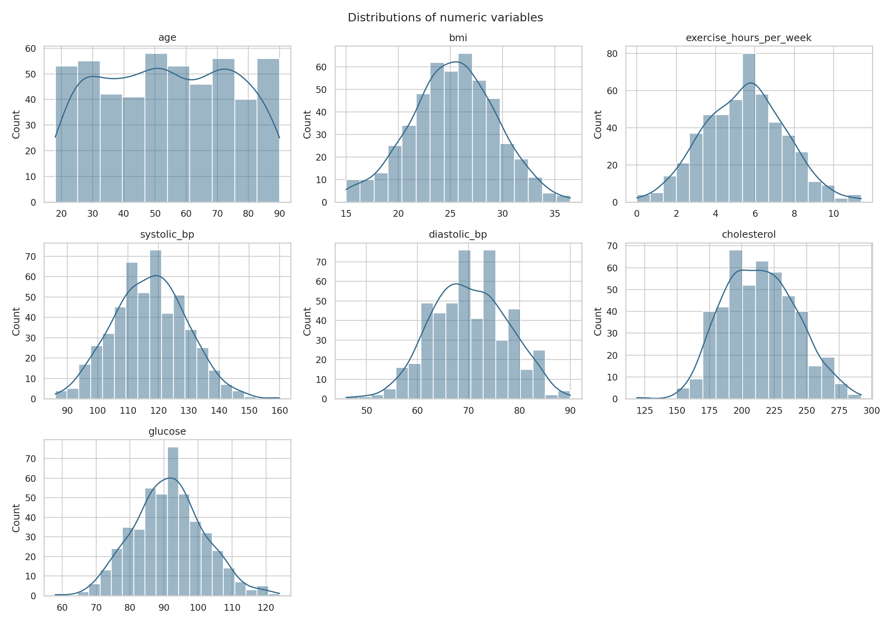
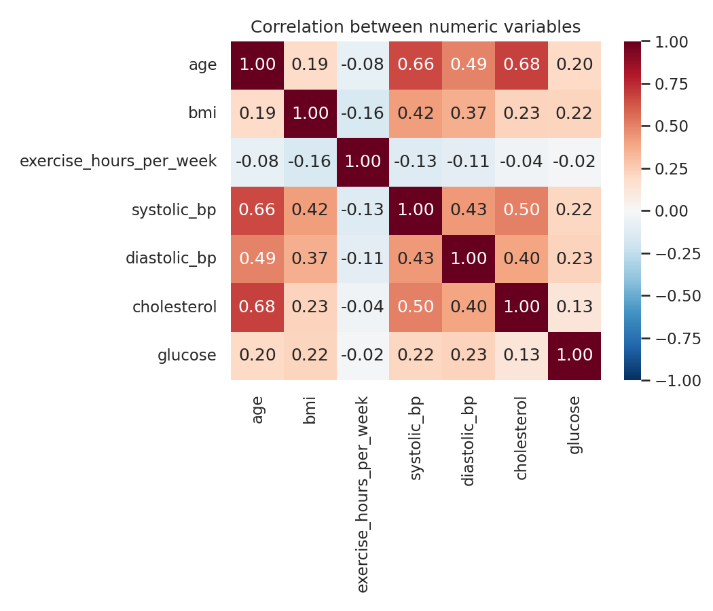

# Exploratory Data Analysis Report

> Generated automatically from synthetic patient health data. This dataset is randomly generated for demonstration purposes and does not represent real patients or real medical findings.

**Rows:** 500  |  **Columns:** 11

## Summary statistics

|                         |   count |   mean |   std |   min |   25% |   50% |   75% |   max |
|:------------------------|--------:|-------:|------:|------:|------:|------:|------:|------:|
| age                     |     500 |  53.94 | 20.87 |    18 |  37   |  54   |  72   |  90   |
| bmi                     |     489 |  25.25 |  4.1  |    15 |  22.7 |  25.3 |  28.1 |  36.5 |
| exercise_hours_per_week |     500 |   5.47 |  2.05 |     0 |   4   |   5.6 |   6.8 |  11.4 |
| systolic_bp             |     500 | 117.23 | 12.04 |    86 | 109   | 118   | 125   | 160   |
| diastolic_bp            |     500 |  70.26 |  7.47 |    46 |  65   |  70   |  75   |  90   |
| cholesterol             |     468 | 214.12 | 27.84 |   119 | 193   | 213   | 233   | 292   |
| glucose                 |     473 |  91.41 | 10.38 |    58 |  85   |  91   |  98   | 124   |

## Missing values

|             |   missing_count |   missing_pct |
|:------------|----------------:|--------------:|
| cholesterol |              32 |           6.4 |
| glucose     |              27 |           5.4 |
| bmi         |              11 |           2.2 |

## Outlier summary (IQR method)

| column                  |   lower_bound |   upper_bound |   n_outliers |   pct_outliers |
|:------------------------|--------------:|--------------:|-------------:|---------------:|
| age                     |         -15.5 |         124.5 |            0 |           0    |
| bmi                     |          14.6 |          36.2 |            2 |           0.41 |
| exercise_hours_per_week |          -0.2 |          11   |            2 |           0.4  |
| systolic_bp             |          85   |         149   |            1 |           0.2  |
| diastolic_bp            |          50   |          90   |            2 |           0.4  |
| cholesterol             |         133   |         293   |            1 |           0.21 |
| glucose                 |          65.5 |         117.5 |            7 |           1.48 |

## Distributions

## Categorical variable counts

## Correlations

The strongest correlation is between **age** and **cholesterol** (r = 0.68).

## Group comparisons

- **systolic_bp** by **smoker**: smoker_0 = 116.2, smoker_1 = 120.6 (t = -3.491, p = 0.0006, statistically significant at α = 0.05)
- **cholesterol** by **smoker**: smoker_0 = 211.46, smoker_1 = 222.66 (t = -3.502, p = 0.0006, statistically significant at α = 0.05)
- **bmi** by **hypertension**: hypertension_0 = 24.85, hypertension_1 = 27.85 (t = -5.258, p = 0.0, statistically significant at α = 0.05)
- **age** by **hypertension**: hypertension_0 = 52.06, hypertension_1 = 66.09 (t = -4.994, p = 0.0, statistically significant at α = 0.05)
